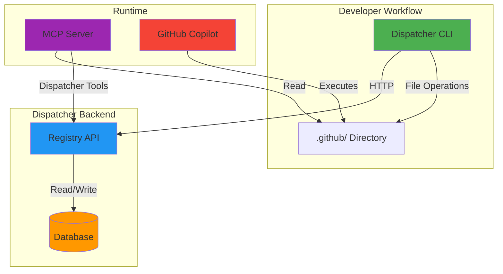
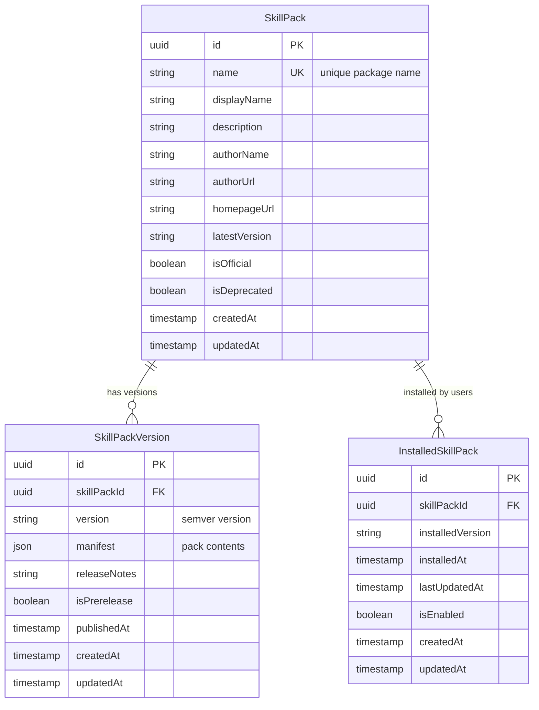
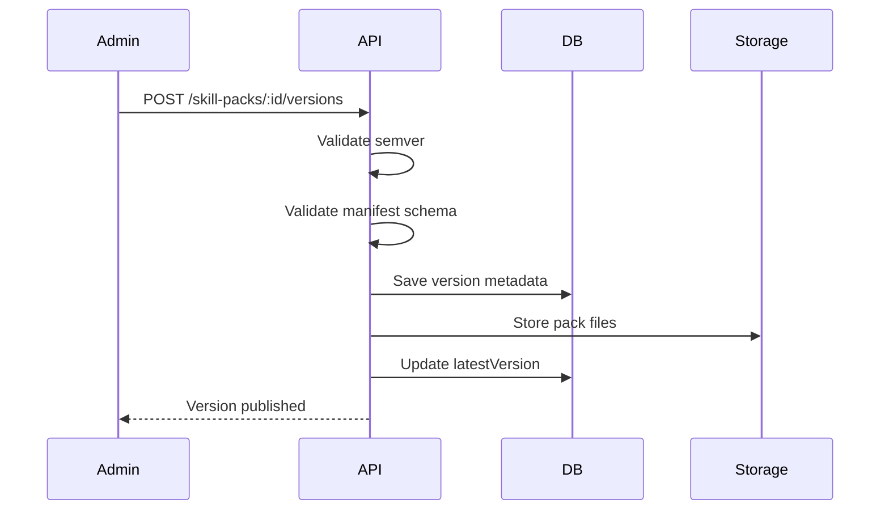
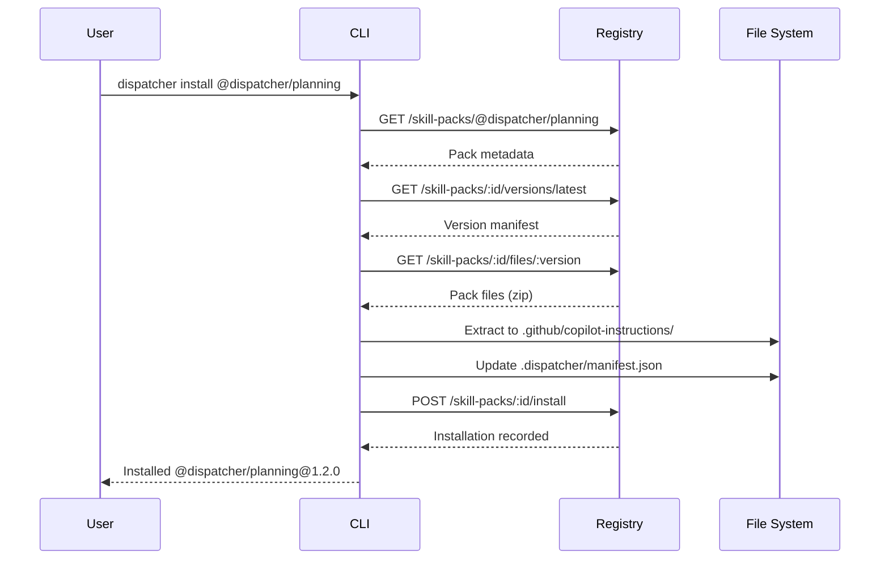
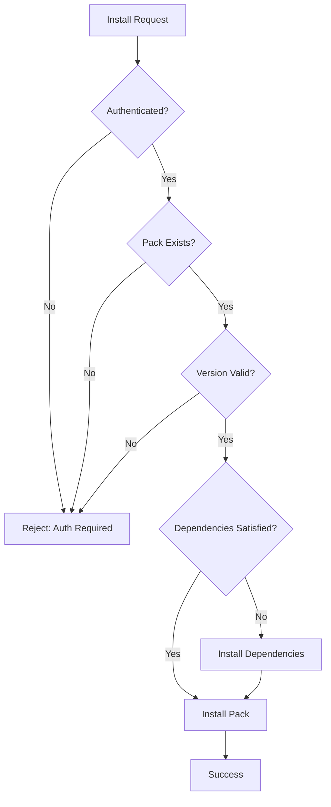
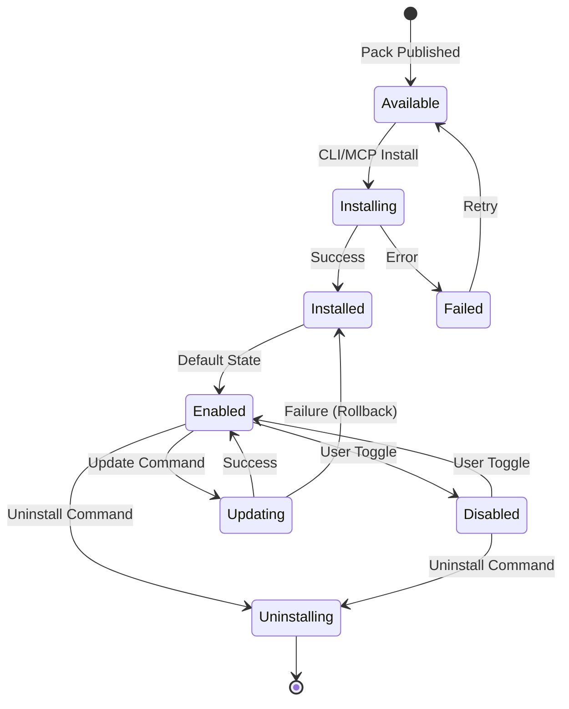

# Skill Pack System Architecture

The Skill Pack system enables reusable, versioned distribution of AI agents, skills, and instructions for GitHub Copilot and other AI tools.

---

## System Overview

The Skill Pack system consists of four primary components that work together to deliver versioned, managed AI capabilities:



### Component Responsibilities

| Component | Purpose | Technology |
|-----------|---------|------------|
| **CLI** | Install, update, and manage skill packs locally | Node.js, Commander |
| **Registry API** | Version catalog, metadata storage, file serving | Fastify, Prisma |
| **Database** | Pack metadata, versions, installations | SQLite/PostgreSQL |
| **MCP Server** | Expose pack management tools to AI agents | Model Context Protocol |
| **File System** | Store installed agents, skills, instructions | `.github/` directory |

---

## Pack Format

Skill Packs are versioned bundles containing agents, skills, and instructions following the GitHub Copilot conventions.

### Manifest Structure

Each pack version has a JSON manifest defining its contents:

```typescript
interface SkillPackManifest {
  name: string;              // "@dispatcher/planning"
  version: string;           // "1.2.3" (semver)
  description?: string;      // Human-readable description
  
  agents?: Array<{
    name: string;            // "planner"
    path: string;            // "agents/planner.md"
    description?: string;
  }>;
  
  skills?: Array<{
    name: string;            // "epic-decomposition"
    path: string;            // "skills/epic-decomposition.md"
    description?: string;
  }>;
  
  instructions?: Array<{
    name: string;            // "dispatcher-context"
    path: string;            // "instructions/context.md"
    description?: string;
  }>;
  
  dependencies?: Record<string, string>;  // "@dispatcher/core": "^1.0.0"
}
```

### Example Manifest

```json
{
  "name": "@dispatcher/planning",
  "version": "1.2.0",
  "description": "AI agents for epic planning and decomposition",
  "agents": [
    {
      "name": "planner",
      "path": "agents/planner.md",
      "description": "Decomposes requirements into structured epics"
    },
    {
      "name": "plan-reviewer",
      "path": "agents/plan-reviewer.md",
      "description": "Reviews and validates implementation plans"
    }
  ],
  "skills": [
    {
      "name": "epic-decomposition",
      "path": "skills/epic-decomposition.md",
      "description": "Step-by-step epic creation workflow"
    }
  ],
  "instructions": [
    {
      "name": "dispatcher-context",
      "path": "instructions/dispatcher-context.md",
      "description": "Core Dispatcher concepts and conventions"
    }
  ],
  "dependencies": {
    "@dispatcher/core": "^1.0.0"
  }
}
```

### File Organization

Installed packs follow this directory structure:

```
.github/
├── copilot-instructions/
│   └── @dispatcher/
│       └── planning/
│           ├── agents/
│           │   ├── planner.md
│           │   └── plan-reviewer.md
│           ├── skills/
│           │   └── epic-decomposition.md
│           └── instructions/
│               └── dispatcher-context.md
└── .dispatcher/
    └── manifest.json          # Local installation record
```

### Versioning Rules

- **Semantic Versioning (semver):** All packs follow `MAJOR.MINOR.PATCH`
- **Latest Stable:** Non-prerelease version with highest semver
- **Prerelease Tags:** Use `-alpha`, `-beta`, `-rc` suffixes (e.g., `1.2.0-beta.1`)
- **Breaking Changes:** Increment MAJOR version for incompatible changes

---

## Registry

The Registry API manages pack metadata, versions, and installation tracking.

### Database Models



### API Endpoints

| Endpoint | Method | Auth | Description |
|----------|--------|------|-------------|
| `/api/v1/skill-packs` | GET | User | List available packs |
| `/api/v1/skill-packs` | POST | Admin | Create new pack |
| `/api/v1/skill-packs/:id` | GET | User | Get pack details |
| `/api/v1/skill-packs/:id` | PATCH | Admin | Update pack metadata |
| `/api/v1/skill-packs/:id/versions` | POST | Admin | Publish new version |
| `/api/v1/skill-packs/:id/versions/:version` | GET | User | Get version manifest |
| `/api/v1/skill-packs/:id/install` | POST | User | Install pack |
| `/api/v1/skill-packs/:id/uninstall` | POST | User | Uninstall pack |
| `/api/v1/skill-packs/installed` | GET | User | List installed packs |
| `/api/v1/skill-packs/:id/enabled` | PATCH | User | Enable/disable pack |

### Version Management

**Publishing Flow:**



**Update Detection:**

The registry tracks `latestVersion` on each `SkillPack` record. When a new non-prerelease version is published:

1. Compare new version against current `latestVersion` using semver
2. If newer, update `latestVersion` field
3. MCP tools can query for packs where `installedVersion < latestVersion`

---

## CLI

The command-line interface manages local pack installations and integrates with the registry.

### Commands

| Command | Description | Example |
|---------|-------------|---------|
| `dispatcher install <pack>` | Install a pack from registry | `dispatcher install @dispatcher/planning` |
| `dispatcher list` | List installed packs | `dispatcher list` |
| `dispatcher list --available` | List all available packs | `dispatcher list --available` |
| `dispatcher update <pack>` | Update pack to latest version | `dispatcher update @dispatcher/planning` |
| `dispatcher update --all` | Update all packs | `dispatcher update --all` |
| `dispatcher publish <path>` | Publish pack to registry | `dispatcher publish ./my-pack` |

### Installation Flow



### Local Manifest

The CLI maintains `.dispatcher/manifest.json` to track installed packs:

```json
{
  "version": "1.0.0",
  "packs": {
    "@dispatcher/planning": {
      "version": "1.2.0",
      "installedAt": "2026-02-16T12:00:00Z",
      "files": [
        ".github/copilot-instructions/@dispatcher/planning/agents/planner.md",
        ".github/copilot-instructions/@dispatcher/planning/skills/epic-decomposition.md"
      ]
    },
    "@dispatcher/orchestrator": {
      "version": "0.5.0",
      "installedAt": "2026-02-15T09:30:00Z",
      "files": [
        ".github/copilot-instructions/@dispatcher/orchestrator/agents/orchestrator.md"
      ]
    }
  }
}
```

### Update Mechanism

**Update Detection:**

1. CLI reads `.dispatcher/manifest.json` to get installed versions
2. Queries registry for latest versions: `GET /skill-packs?ids=...`
3. Compares versions using semver
4. Reports available updates

**Update Execution:**

1. Download new version manifest and files
2. Remove old files listed in manifest
3. Install new files
4. Update local manifest
5. Record update in registry

---

## MCP Tools

The MCP server exposes pack management tools for AI agents to discover, install, and update packs during workflows.

### Available Tools

| Tool | Purpose | When to Use |
|------|---------|-------------|
| `dispatcher__list_skill_packs` | List available packs from registry | Discovery, browsing catalog |
| `dispatcher__get_skill_pack` | Get details about a specific pack | Before installation |
| `dispatcher__install_skill_pack` | Install pack by ID/name and version | Initial setup, adding capabilities |
| `dispatcher__update_skill_pack` | Update pack to new version | Maintenance, applying fixes |
| `dispatcher__list_installed_packs` | List locally installed packs | Status checks, auditing |
| `dispatcher__get_pack_manifest` | Get manifest for a specific version | Understanding pack contents |
| `dispatcher__sync_local_packs` | Detect drift between local and registry | Cleanup, drift detection |

### Guided Workflow Tools

The MCP server provides composite tools that guide AI agents through complete workflows:

```typescript
// Example: Guided pack installation
dispatcher__manage_skill_packs({
  action: "install",
  id: "@dispatcher/planning",
  version: "1.2.0"
})

// Returns:
{
  "message": "Installed @dispatcher/planning@1.2.0",
  "installedFiles": [...],
  "nextSteps": [
    "Review installed agents in .github/copilot-instructions",
    "Commit changes to version control",
    "Use @planner agent to create your first epic"
  ]
}
```

### Agent Usage Example

An AI agent can install packs autonomously:

````markdown
**User:** "Set up Dispatcher planning capabilities"

**Agent:** I'll install the planning skill pack:

```typescript
dispatcher__install_skill_pack({
  id: "@dispatcher/planning",
  version: "latest"
})
```

Installed `@dispatcher/planning@1.2.0` with:
- @planner agent for epic decomposition
- @plan-reviewer agent for validation
- Epic decomposition skill

You can now use `@planner "Create a REST API for user preferences"` to generate structured epics.
````

---

## Enforcement

The system provides multiple enforcement mechanisms to guide users toward using skill packs effectively.

### Validation Gates

**Pre-Installation Checks:**



**Post-Installation Validation:**

1. Verify all files were written successfully
2. Check `.dispatcher/manifest.json` is valid JSON
3. Confirm no file conflicts with existing packs
4. Validate file permissions

### State Machine

Pack installations follow this lifecycle:



### AI Agent Reminders

The MCP server includes enforcement reminders in tool responses:

```typescript
// Example response from dispatcher__list_installed_packs
{
  "packs": [...],
  "reminders": [
    "✅ 3 packs installed and up-to-date",
    "⚠️ @dispatcher/orchestrator has an update available (0.5.0 → 0.6.0)",
    "💡 Consider running `dispatcher update @dispatcher/orchestrator`"
  ]
}
```

---

## Extension Points

Developers can create custom skill packs for organization-specific workflows.

### Creating a Custom Pack

**1. Directory Structure:**

```
my-custom-pack/
├── pack.json              # Pack metadata
├── agents/
│   └── custom-agent.md
├── skills/
│   └── custom-skill.md
└── instructions/
    └── custom-instructions.md
```

**2. Pack Metadata (`pack.json`):**

```json
{
  "name": "@myorg/custom-pack",
  "version": "1.0.0",
  "displayName": "My Organization Pack",
  "description": "Custom workflows for our team",
  "author": {
    "name": "Engineering Team",
    "url": "https://myorg.com"
  },
  "agents": [
    {
      "name": "custom-agent",
      "path": "agents/custom-agent.md",
      "description": "Organization-specific automation agent"
    }
  ],
  "skills": [
    {
      "name": "custom-skill",
      "path": "skills/custom-skill.md"
    }
  ],
  "instructions": [
    {
      "name": "org-conventions",
      "path": "instructions/custom-instructions.md"
    }
  ],
  "dependencies": {
    "@dispatcher/core": "^1.0.0"
  }
}
```

**3. Publishing:**

```bash
# From your custom pack directory
dispatcher publish .
```

**4. Installation:**

```bash
# On other machines
dispatcher install @myorg/custom-pack
```

### Distribution Models

**Public Registry:**
- Publish to Dispatcher registry for community use
- Requires review for `@dispatcher/` namespace
- Open source encouraged

**Private Registry:**
- Host your own registry instance
- Use `--registry` flag: `dispatcher install @myorg/pack --registry https://registry.myorg.com`
- Corporate/proprietary content

**Git-based:**
- Commit packs directly to `.github/copilot-instructions/`
- No registry dependency
- Manual version management

---

## Design Decisions & Tradeoffs

### Why Skill Packs?

**Problem:** Copying agents and skills between projects is error-prone and creates divergent versions.

**Solution:** Centralized, versioned distribution with semantic versioning and dependency management.

**Tradeoff:** Adds complexity (registry, CLI, MCP integration) but provides consistency and update management.

### Why `.github/copilot-instructions/`?

**Decision:** Store packs in `.github/` directory following GitHub Copilot conventions.

**Rationale:**
- Native Copilot support for loading instructions from `.github/`
- Version control friendly (commit packs with code)
- Standard location across projects

**Tradeoff:** Tightly coupled to GitHub/Copilot ecosystem, but enables seamless integration.

### Why Manifest-First?

**Decision:** Store manifest in database, files served separately.

**Rationale:**
- Fast queries for pack metadata without reading files
- Version comparison using database indexes
- Enables lazy file download (manifest first, files on install)

**Tradeoff:** Two-phase fetch (manifest → files), but optimizes common operations like listing and updates.

### Why MCP Tools?

**Decision:** Expose pack management via MCP instead of requiring CLI invocation.

**Rationale:**
- AI agents can install/update packs autonomously
- Workflow integration (e.g., orchestrator installs dependencies)
- Consistent tool interface

**Tradeoff:** Requires MCP server running, but enables guided AI workflows.

---

## Related Documentation

- **[Quick Start Guide](../quick-start.md)** — Install your first skill pack
- **[CLI Reference](../cli/README.md)** — Complete CLI command documentation
- **[API Reference](../api/skill-pack-endpoints.md)** — Registry API endpoints
- **[MCP Tools](../mcp/tools-reference.md)** — Pack management tools for AI agents
- **[Publishing Guide](../guides/publishing-skill-packs.md)** — Create and publish your own packs
