# Git Release Flow Strategy (Desktop + Mobile)

> **⚠️ FUTURE WORKFLOW NOTICE**  
> **Current Status**: This document describes a **planned future workflow** for when Dispatcher reaches production maturity with customer deployments, QA/Lab validation cycles, and multiple release trains.
>
> **Current Workflow**: Dispatcher currently uses trunk-based development with continuous deployment from `main`. See [`CONTRIBUTING.md`](../../CONTRIBUTING.md) for the current workflow.
>
> **When This Applies**: This release train workflow will be adopted when:
> - Dispatcher has production customers requiring stable releases
> - QA/Lab validation cycles are established (4–6 weeks)
> - Multiple versions need concurrent support
> - Release branches and RC tags become necessary

---

**Audience:** Engineering, QA/Lab, Release Management  
**Applies to:** Desktop and Mobile repositories (independent repos, same strategy)

---

### Document Organization

This document is organized as follows:

| Sections | Content |
|----------|---------|
| **1–2** | Purpose and terminology definitions |
| **3–6** | Core strategy: branch roles, protections, naming |
| **7–10** | **Standard workflows** (start here for day-to-day work) |
| **11–14** | Advanced scenarios: forward-porting, multi-train, customer hotfixes |
| **15–16** | Rationale and success criteria |
| **17–22** | Operational details: automation, conflict resolution, merge strategies |

> **New to this workflow?** Start with Sections 7–10 for the standard development and release cycle, then refer to other sections as needed.

---

## 1. Purpose & Context

This document defines the **authoritative Git branching and release strategy** for our software platform given:

- Long, manual, hardware-dependent QA/lab validation cycles (often 4–6 weeks)
- The need to begin the next release immediately after lab handoff
- Desktop customers who do not auto-update
- A strong preference to resolve customer issues via upgrade when possible
- Occasional urgent production hotfixes that must also flow into future releases

The goal is to **enable parallel work safely** while ensuring:
- No validated fix is lost
- Release branches remain stable
- Engineers always know *where a fix belongs*

---


## 2. Definitions & Canonical Terms

This section defines **authoritative terminology** used throughout this document.  
These definitions are written for both human readers and AI-based analysis (e.g., Copilot, RAG).

### Main
The single, protected integration branch representing the **next planned release**.
- Accepts work only via Pull Requests
- Advances forward continuously
- Example: after `release/9.1` is cut, `main` represents version 9.2

### Release Branch (`release/x.y`)
A temporary stabilization branch created from `main` for QA/Lab validation and release.
- Fix-only
- Exists only while the release train is active
- Deleted after stabilization and retirement

### Feature Branch
A short-lived branch created from `main` to implement new functionality.
- Merged back into `main` via PR
- Never targets `release/*`

### Bugfix Branch
A short-lived branch created from either `main` or `release/x.y` to fix defects.
- Target branch depends on where the bug must be fixed

### Hotfix
A high-severity bug fix required for a released production version.
- Usually applies to older versions
- May require temporary recreation of a `release/x.y` branch from a tag

### Forward-Porting
The act of applying a fix from an **older release line to all newer release lines**, including `main`, to ensure the fix is not lost.

Forward-porting:
- Always moves **forward in time** (older → newer)
- Is typically performed via merge-forward
- May use cherry-pick only in exceptional cases
- Is **not rebasing**

### Merge-Forward
Applying fixes by merging a release branch into a newer branch (e.g., `release/9.1` → `main`).  
This is the preferred forward-port mechanism.

### Cherry-Pick
Applying a specific commit from one branch to another.
- Allowed only in exceptional cases
- Must reference the originating PR
- Should be avoided as a primary strategy

### Rebase
Rewriting commit history to create a linear sequence.
- Allowed only on private or short-lived branches
- **Never used** to move fixes between release trains


#### Rebase Policy Rationale (Balanced)


### Why Some Rebase Tutorials Look Different (Side-by-Side)

Many “rebase explained” tutorials demonstrate a workflow where **rebased feature commits end up on `main`**. That is not because `git rebase` *automatically* changes `main`, but because the tutorial then **updates `main` explicitly** (often locally) and pushes it.

In our environment, `main` and `release/*` become authoritative once shared and/or once QA begins. Therefore, we **do not** use tutorial-style “rewrite `main` then push” workflows.

---

#### A) Tutorial-Style Rebase Workflow (Fast, Single-Train, Linear History)

**Assumptions:** short-lived branches, fast automated tests, no RC tags, no long-running manual QA tied to commit identity.

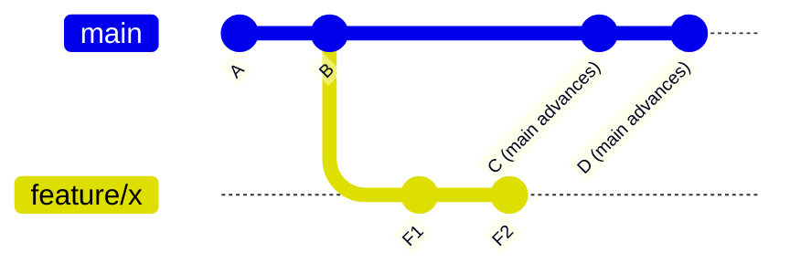

**Step 1 — Rebase the feature branch onto updated `main` (rewrites F1/F2 → F1′/F2′):**

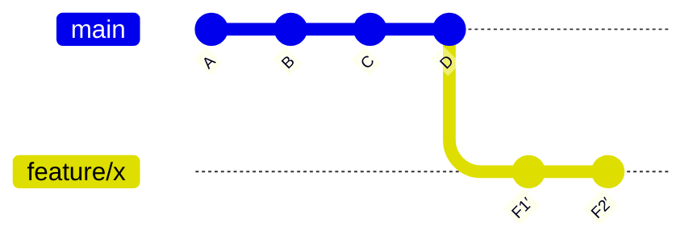

**Step 2 — Integrate into `main` (often fast-forward or merge):**

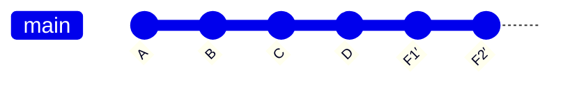

**What this yields:** a very linear history on `main`, and commit identity is not used as an external “approval artifact.”

---

#### B) Our Workflow (Release Trains + RC Tags + Manual QA Traceability)

**Assumptions:** long QA cycles, manual validation, RC tags, parallel trains (`release/*` + `main`), auditability required.

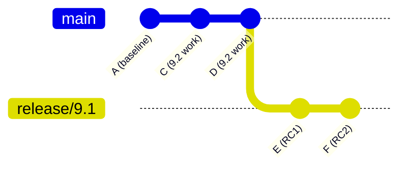

- QA approves **specific commits** (e.g., RC tags on **E/F**).
- We must preserve a provable link between QA results and the release branch tip.
- We therefore **do not rewrite** `release/*` after RCs exist, and we **do not rewrite `main`**.

**Fix propagation is done via forward-porting (PR merge-forward), not rebase:**
- Stabilize on `release/9.1` (RC1 → RC2 → …)
- Then PR merge-forward into `main` so 9.2 inherits validated fixes
- History stays append-only; approvals remain valid and auditable

> **Key difference:** Tutorial workflows optimize for a pretty `main`.  
> Our workflow optimizes for **provable validation** across long-running QA and parallel release trains.


#### Rebasing vs RC Validation in Long QA Cycles (Detailed Scenario)

The sequence below reflects **how QA actually works in our environment** and why rebasing creates risk when RCs are involved.

---

### Normal QA Stabilization Flow (RC1 → RC2 → …)

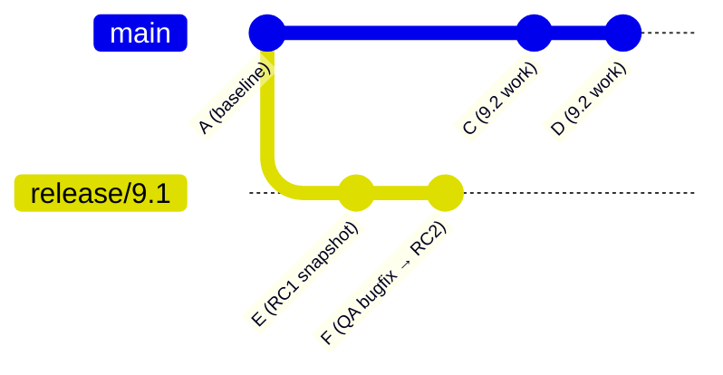

- **RC1 (`v9.1.0-rc1`)** is tagged on commit **E** and tested by QA
- QA finds a defect
- Engineer fixes the defect on `release/9.1` → commit **F**
- **RC2 (`v9.1.0-rc2`)** is tagged on **F** and re-tested
- This cycle may repeat (RC3, RC4, …) until QA passes
- When QA passes, the final release tag is created from the last RC commit

> Each RC tag represents **a distinct QA approval event tied to a specific commit**.

---

### What Happens If a Rebase Occurs After RC Validation (Redrawn Correctly)

This redraw is intentionally explicit about the key fact:

> **Rebasing `release/9.1` onto `main` does *not* change `main`.**  
> It rewrites the history of `release/9.1` by replaying its commits on top of `main`, creating new commits (**E′, F′**) with new SHAs.

#### Before Rebase (QA tested RC1 + RC2 on the release branch)

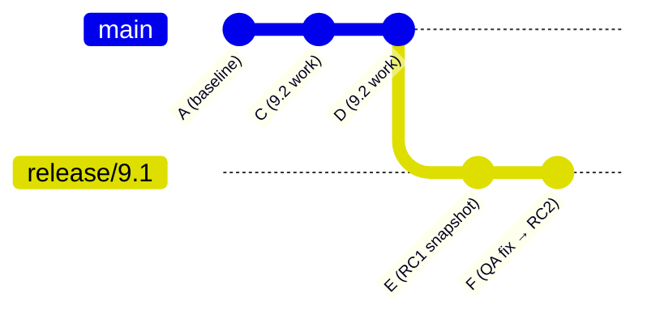

- `main` tip is **D**
- `release/9.1` tip is **F**
- RC tags point to **E** (RC1) and **F** (RC2)

#### After Rebase (main is unchanged; release branch is rewritten)

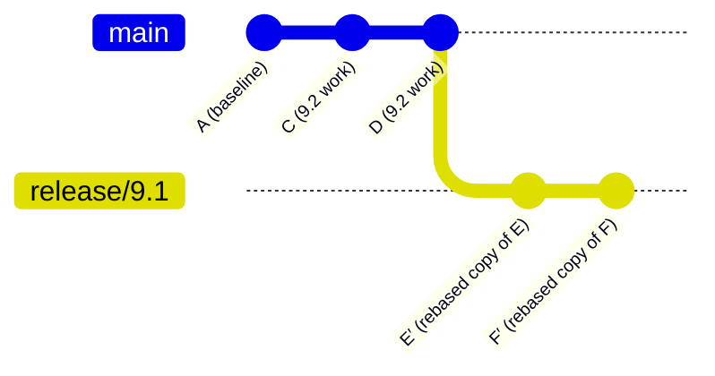

**How to read this correctly:**
- `main` still ends at **D** (no new commits were added to `main` by the rebase)
- `release/9.1` now ends at **F′**
- **E and F still exist in the repo**, but the branch pointer no longer points to them

**Consequences:**
- RC tags still point to **E** and **F**
- The branch tip now points to **F′**
- QA validated **F**, not **F′**
- Git cannot prove that **F′** is equivalent to **F**
- QA approvals, RC tags, PR reviews, and Issue references are now disconnected from the active release branch history

#### After Rebase + New Work via Short-Lived Branch + PR (What it looks like next)

Even if engineers continue “correctly” (short-lived branch + PR) after the rebase, the **traceability gap remains** because the base of the release branch was rewritten.

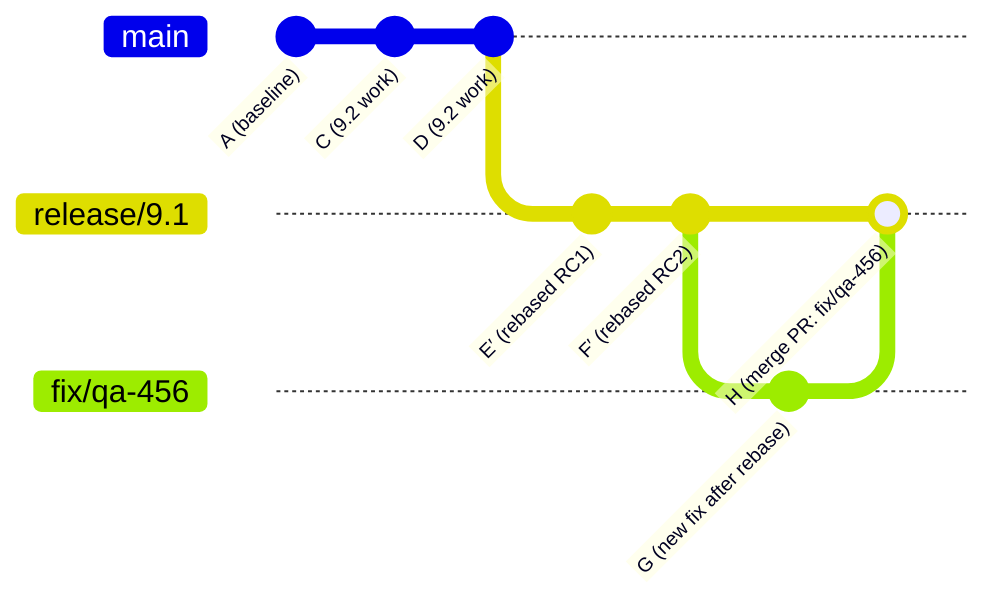

- Engineers did the “right” thing for **new** work (branch + PR)
- But the release train’s validated lineage is still split:
  - QA validated **F** (RC2), but the branch contains **F′**
  - Future work (G/H) builds on **F′**, not the validated **F**

> **Key takeaway:** Once a QA-validated release branch is rebased, *all subsequent commits are built on rewritten history*, and you lose a provable link between QA results and the branch tip.


### Why This Is Unacceptable in Our Environment

- QA approval is manual and time-consuming
- Validation is tied to **exact commits**, not “similar code”
- Hardware state and test conditions matter
- Rebasing invalidates the trust chain between:
  - QA results
  - RC tags
  - Release artifacts

> **Key principle:**  
> After QA validates an RC, that commit must remain immutable.  
> Rebasing violates this principle by rewriting commit identity.

---

### Correct Alternative: Forward-Porting

- Fixes are applied on the release branch
- Each RC remains a stable, auditable snapshot
- Once validated, fixes are **forward-ported** to `main`
- Release history remains append-only and traceable

---

### Same Scenario Using the Proposed Process (No Rebase, With Forward-Porting)

Below is the *same* RC1 → bug → RC2 sequence, but using the proposed workflow: **no rebasing**, and **forward-porting fixes forward** after they are validated.

#### 1) RC Stabilization on `release/9.1` (RC1 → RC2 → …)


- QA tests **RC1** (tag on **E**). If a defect is found, engineering fixes on `release/9.1`.
- Engineering creates **RC2** (tag on **F**) and QA re-tests.
- This repeats (RC3, RC4, …) until QA passes.

#### 2) Forward-Port the Validated Fix to `main` (Preserve QA Traceability)

After the fix is validated on `release/9.1`, we forward-port it to `main` **without rewriting history**:

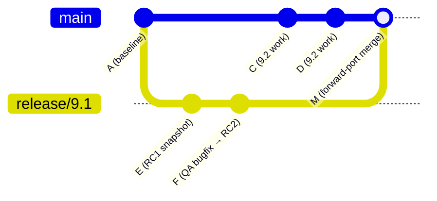

- `release/9.1` retains **E** and **F** exactly as QA tested them.
- `main` receives the fix via a PR/merge (creating merge commit **M** or an equivalent merge record), preserving a clear lineage.

#### Advantages of the Proposed Process

**1) QA traceability remains intact**
- RC tags point to commits that remain on the release branch.
- “What QA tested” remains provable and auditable.

**2) `main` still progresses as 9.2**
- New 9.2 work continues independently on `main`.
- Fixes propagate forward, so 9.2 includes 9.1 fixes by design.

**3) Reduced risk under urgency**
- No force-push, no rewritten SHAs, no confusion about “equivalent code”.
- Forward-porting is repeatable and reviewable (PR links, Issue links, approvals).

**4) Clear accountability**
- The fix lands in the release train first (where it was found),
  then is forward-ported to ensure the next release also contains it.

> **Key takeaway:**  
> The proposed process preserves the QA trust chain (RC1/RC2/…) while still ensuring `main` (9.2) automatically inherits validated fixes—without the risks of rebase.


 **Key takeaway:** QA does not approve “code that looks the same.”  
> QA approves a **specific commit**. Rebasing invalidates that approval.


** Rebasing optimizes for visual cleanliness.  
> Our environment optimizes for **predictability, traceability, and safety**.


Rebasing is a popular workflow preference in many engineering organizations because it can produce a cleaner, more linear history. However, in our environment (long manual QA cycles, multiple concurrent release trains, and a strong need for predictable integration), rebasing must remain the **exception**, not the default.

**Why some developers like rebasing**
- **Linear history:** Avoids “merge bubbles,” making `git log` easier to read.
- **Cleaner commits:** Encourages squashing/fixups and a tidy PR before merge.
- **Easier bisecting in some cases:** A linear history can simplify `git bisect` when commits are well-structured.
- **Common in fast CI/CD environments:** Teams with heavy automation and short feedback loops can rebase frequently with minimal coordination cost.

**Why we restrict rebasing in our environment**
- **History rewriting increases coordination risk:** Rebasing rewrites commit SHAs. If a branch is shared, reviewers and tools can lose context, and teammates can accidentally build on obsolete commits.
- **Higher chance of “lost work” under pressure:** During urgent hotfixes and lab defect turnaround, the cognitive overhead of rebasing can lead to mistakes (force-pushes, dropped commits, confusing diffs).
- **Multi-train complexity:** We frequently need to reason about what was validated in `release/x.y` vs what is progressing in `main`. Predictable, append-only history reduces ambiguity when multiple trains run in parallel.
- **Auditability and traceability:** PR review artifacts, QA references, and links to Issues are easier to track when commits are not rewritten midstream.
- **We can get clean history without broad rebasing:** Using **squash merge** (or rebase-merge at merge time) can keep `main` tidy while avoiding repeated rebases during review.

**What we allow (practical compromise)**
- **Allowed:** Rebasing on a **private** short-lived branch (owned by one engineer) to clean up commits **before** requesting review.
- **Allowed with caution:** Rebasing after a PR is opened **only if** the branch is not shared, the author understands the implications, and force-push is acceptable to reviewers.
- **Not allowed:** Rebasing to move changes between release trains (e.g., `release/9.1` → `main`). Use forward-porting mechanisms (merge-forward or exceptional cherry-pick) instead.

> Bottom line: We optimize for **predictability, safety, and traceability** over perfectly linear history. This is the right trade in an environment with long QA cycles and parallel release trains.

### Fix-Only Change
A change that:
- Corrects a defect
- Adds minimal diagnostics required for validation
- Does **not** add features, refactors, or cleanups

### Release Candidate (RC)
A tagged snapshot (`vX.Y.Z-rcN`) created **on a release branch (`release/x.y`)** and used for QA/Lab testing.

- RC tags are always applied to commits on the release branch
- QA/Lab tests tags, not branches
- RC tags are never created on `main`

### Forward-Port Plan
A declaration in a PR describing:
- Whether forward-porting is required
- Which branches will receive the fix
- Links to follow-up PRs

### Release Manager
The individual responsible for:
- Enforcing release rules
- Resolving ambiguity
- Approving fix-only changes
- Final decisions when scenarios are unclear


## 3. Strategy Overview (Release Flow)

We adopt a **Release Flow** model:

- One forward-moving integration branch: `main`
- One release branch per active release: `release/x.y`
- Short-lived feature/bugfix branches for all work
- Strict “fix-only” rules on release branches
- Mandatory forward-porting of release fixes

> Note: We intentionally avoid the term “trunk-based development.” While some concepts overlap, classic TBD assumptions (short QA cycles, heavy CI/CD, frequent deploys) do not match our environment.

---

## 4. Branch Roles

### Permanent Branches

#### `main`
- Represents the **next release in development**
- Protected: PR-only, no direct pushes
- Always buildable
- Advances only via PR merges

> Example: After `release/9.1` is cut, `main` logically represents version 9.2.

#### `release/x.y` (e.g., `release/9.1`)
- Stabilization branch for QA/lab and shipping
- **Fix-only**
- Source of truth for release candidates and final tags

### Temporary Release Branches

#### `release/x.y` for older production versions (e.g., `release/9.0`)
- Created only when an urgent production hotfix is required
- Deleted or archived once no longer needed

---


### Release Branch Lifecycle Policy (Important Clarification)

Release branches (`release/x.y`) are **not permanent**. They are **temporary stabilization branches** that exist only while a release train is active.

#### Lifecycle

1. **Creation**
   - Created from `main` when a version is handed to QA/Lab
   - Example: `main` → `release/9.1`

2. **Active Stabilization**
   - QA/Lab testing occurs on immutable tags (`v9.1.0-rc*`)
   - Bug fixes are merged into `release/9.1`
   - All fixes are **forward-ported** to `main`

3. **Production Release**
   - Final release tag created (e.g., `v9.1.0`)
   - Branch may remain briefly in case an immediate patch is required

4. **Retirement**
   - Once the release is stable in production **and**
   - No further `9.1.x` patches are planned **and**
   - All fixes have been forward-ported to `main`
   - ➜ **Delete the `release/9.1` branch**

#### Policy Statement

> **Release branches are temporary.**  
> A `release/x.y` branch exists only while that version is under active stabilization or patching.  
> Once a release is stable and no further fixes are planned, the branch must be deleted.  
> Historical state is preserved via immutable tags (e.g., `v9.1.0`, `v9.1.1`) and PR history.

#### Customer Support vs Branch Support

- Supporting customers on older versions does **not** imply a permanent branch
- If a critical issue is discovered after branch retirement:
  1. Recreate the branch from the release tag  
     `git checkout -b release/9.1 v9.1.0`
  2. Apply the hotfix and ship `v9.1.1`
  3. Forward-port the fix to `main`
  4. Delete the branch again when complete


## 5. Branch Protections (Mandatory)

### `main` and `release/*`

- PR-only (no direct pushes)
- Build validation required
- Minimum reviewers enforced
- Linked work item required
- PR template completion required

> Important: No human ever commits directly to `main` or `release/*`.

---

## 6. Branch Naming Conventions

Version numbers are **not included** in branch names to avoid drift.

- `feature/<ticket>-<summary>`
- `bugfix/<ticket>-<summary>`
- `hotfix/<ticket>-<summary>`

**The PR target determines the release train**, not the branch name.

---

## 7. Standard Workflow (Most Common Case)

### Step 1: Cut a Release Branch

1. Ensure `main` is releasable
2. Create `release/9.1` from `main`
3. Tag `v9.1.0-rc1`
4. QA/Lab tests **tags only**
5. Development continues immediately on `main`

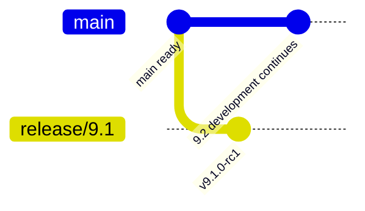

---

## 8. How Development Continues on the Next Release (9.2)

When this document says:

> “Work continues on `main` (9.2)”

It means:

- Engineers create **short-lived branches from `main`**
- All work is merged back into `main` via PR
- `main` itself is never a working branch

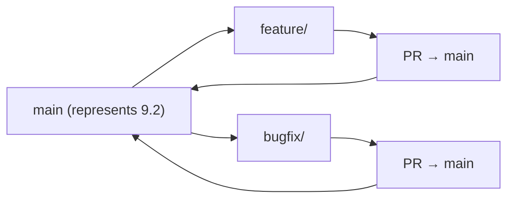

---

## 9. Fix-Only Rule for Release Branches (Critical)

Release branches **must not** become secondary development branches.

Allowed changes:
- Bug fixes
- Minimal logging or diagnostics
- Configuration or guard-rail changes required for stability

Not allowed:
- New features
- Refactors
- Cleanup or "while I'm here" changes

> **⚠️ This is the most critical rule in the entire strategy.**  
> Violation creates multiple `develop` branches running in parallel, which is exactly what this workflow is designed to prevent. Every developer must understand *why* this rule exists, not just that it exists.

**Enforcement**
- Required `release-fix` label
- Release Manager or Tech Lead approval
- PR template checkbox: "Fix-only change confirmed"
- Team education: All developers must be trained on the rationale during onboarding

---

## 10. Lab Bug Fix Workflow

1. Lab finds a bug in `release/9.1`
2. Create bugfix branch from `release/9.1`
3. PR into `release/9.1`
4. Tag a new RC if required
5. **Forward-port the fix to `main`**

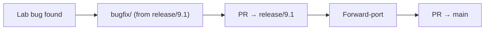

---

## 11. Forward-Porting (Mandatory)

### Definition

**Forward-porting** means applying a fix from an older release line to a newer one.

Typical directions:
- `release/9.1` → `main`
- `release/9.0` → `release/9.1` → `main`

### Approved Mechanisms

**Preferred: Merge-forward**
```bash
git checkout main
git merge release/9.1
```

**Exception-only: Cherry-pick**
Used only when merge-forward is not practical. This should be rare.

Acceptable scenarios:
1. **Human error recovery:** A fix was mistakenly applied to `main` first and must be backported to `release/9.1` without pulling unrelated 9.2 work
2. **Stale merge-forward state:** A full merge would pull many unrelated commits due to delayed forward-porting
3. **Surgical emergency:** An urgent hotfix requires minimal, isolated change propagation

Cherry-pick PRs must:
- Reference the originating PR
- Contain the same functional diff unless adaptation is required
- Include justification for why merge-forward was not used

> **Note:** If cherry-pick becomes frequent, it indicates a process breakdown (likely delayed forward-porting). Escalate to Release Manager.

---

## 12. Roles & Responsibilities

### PR Author
- Owns the original fix
- Owns all required forward-port PRs
- Ensures links between originating and forward-port PRs

### Release Manager / Tech Lead
- Enforces fix-only rules
- Assigns ownership if the author is unavailable
- Confirms forward-port completion before release sign-off

**Forward-port SLA:** within 2 business days of the originating merge

---

## 13. Customer-Reported Bugs on Older Versions (e.g., 9.0)

Default posture: **upgrade-first**.

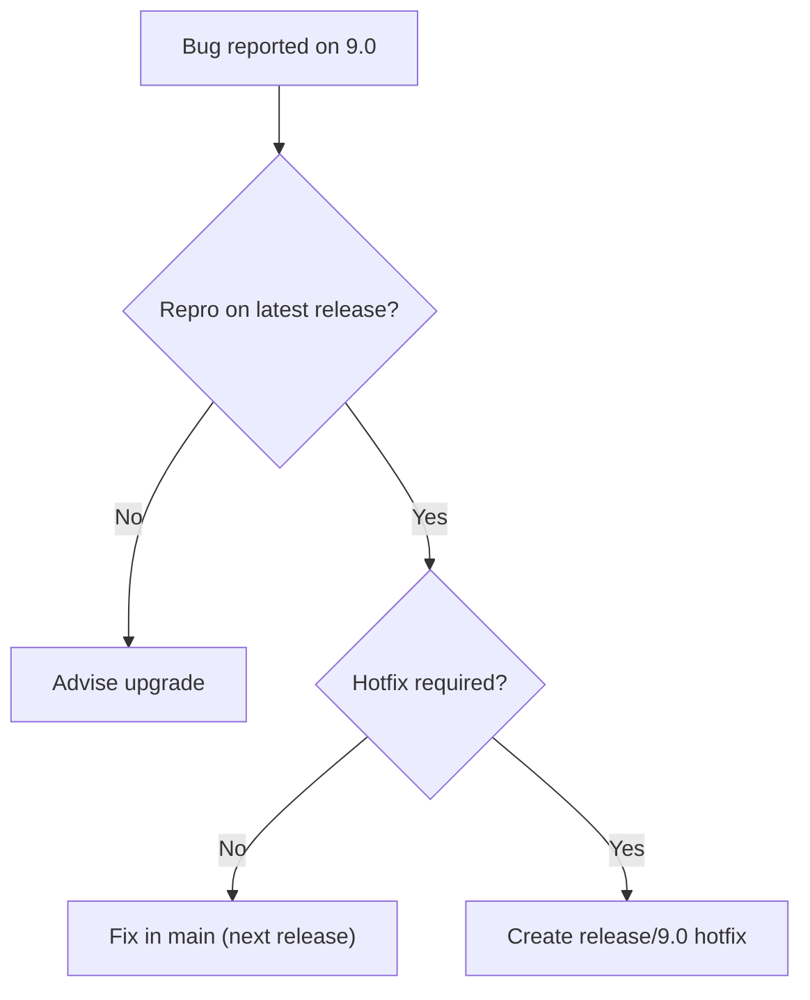

---

## 14. Multi-Train Scenario (9.1 in Lab, 9.2 Active, Urgent 9.0 Hotfix)

Active trains:
- `release/9.0` – urgent production hotfix
- `release/9.1` – lab stabilization
- `main` – next release (9.2)

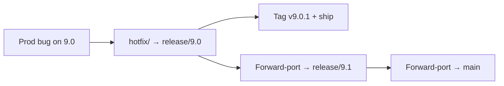

**Key rule:**  
We never pull 9.2 work backward. We only **push fixes forward**.

---

## 15. Why Not GitFlow

Classic GitFlow introduces:
- Multiple long-lived integration branches
- Complex merge paths
- High drift risk during long QA cycles

Release Flow provides the required stabilization without multiplying “truth” branches.

---

## 16. Success Criteria

Within 1–2 release cycles:

- Next-release work starts immediately after lab handoff
- No validated fix is missing from future releases
- Release branches remain stable and predictable
- Engineers can always answer:
  - Where do I branch from?
  - Where does this PR go?
  - How does this fix reach the next release?

---

**Decision:**  
This document defines the official Git strategy for the team.


---

## 17. Issue-Driven Workflow (AI & Automation Friendly)

GitHub Issues are the **system of record** for all work (features, bugs, hotfixes).  
Every Pull Request must reference an Issue.

This section is intentionally written for **human clarity and AI/RAG consumption**.

### 16.1 Required Issue Fields (Canonical Scenario Input)

Each Issue must include:

- Issue Type: Feature | Bug | Hotfix
- Version Found (e.g., 9.0, 9.1-lab, main)
- Reproducible on Latest Release: Yes | No | Unknown
- Reproducible on `main`: Yes | No | Unknown
- Severity: S1 | S2 | S3 | S4
- Desired Outcome: Upgrade-only | Hotfix required
- Expected Target Train: main | release/x.y
- Forward-Port Required: Yes | No | Unknown

### 16.2 Required PR Fields

Each Pull Request must include:

- Linked Issue (`Fixes #123`)
- Target Branch Justification
- Fix-Only Confirmation (for `release/*`)
- Forward-Port Plan (links or justification)

### 16.3 Deterministic Enforcement

Enforced via GitHub rulesets and Actions:

- PR required for `main` and `release/*`
- `release/*` PRs require label `release-fix`
- Forward-Port Plan required for `release/*`

### 16.4 Copilot Responsibilities (Soft Enforcement)

Copilot is expected to:
- Validate branch targeting vs Issue fields
- Flag fix-only violations
- Prompt for missing forward-port PRs
- Recommend applicable scenario from this document

### 16.5 Escalation Rule

If branch targeting or forward-port responsibility is unclear:
- Release Manager decision is final
- Decision must be recorded on the Issue

---

## 18. Merge Conflict Resolution During Forward-Porting

Forward-porting via merge-forward may encounter conflicts. This section defines ownership and process.

### 17.1 Conflict Types

**Textual conflicts** – Git cannot auto-merge due to overlapping changes.
- Resolution: Manual merge by the forward-port PR author.

**Semantic conflicts** – Code merges cleanly but breaks functionality (e.g., a fix references a function that was refactored in `main`).
- Resolution: Requires adaptation by the forward-port PR author, with review.

### 17.2 Conflict Ownership

| Scenario | Owner |
|----------|-------|
| Author available | Original PR author resolves conflicts |
| Author unavailable | Release Manager assigns a delegate |
| Complex semantic conflict | Tech Lead review required before merge |

### 17.3 Conflict Resolution Process

1. Attempt merge-forward; if conflicts occur, resolve locally
2. If resolution requires code adaptation beyond the original fix scope:
   - Document the adaptation in the PR description
   - Request additional review from someone familiar with the target branch
3. Run full CI validation on the forward-port PR
4. If conflicts are extensive, escalate to Release Manager for guidance (cherry-pick may be appropriate)

> **Principle:** A forward-port PR should contain the same *functional* fix. Adaptation for context is acceptable; scope creep is not.

---

## 19. Emergency Bypass & Authority Chain

When urgent decisions are required and the primary Release Manager is unavailable, this authority chain applies.

### 18.1 Authority Chain (in order)

1. **Release Manager** – Primary authority for all release decisions
2. **Tech Lead** – Backup authority when Release Manager is unavailable
3. **Engineering Manager** – Final escalation for unresolved conflicts or policy exceptions

### 18.2 Emergency Bypass Criteria

A bypass may be invoked when:
- A P1/S1 production issue requires immediate action
- The Release Manager cannot be reached within **1 hour**
- Delaying the fix would cause significant customer impact

### 18.3 Bypass Process

1. Document the emergency in the Issue (severity, customer impact, attempts to reach Release Manager)
2. Obtain approval from the next available authority in the chain
3. Proceed with the fix following all other policy requirements
4. Notify the Release Manager as soon as possible
5. Release Manager reviews the decision within **1 business day** and records ratification or corrective action

> **Principle:** Emergencies justify expedited decisions, not skipped process. All fixes still require PRs, reviews, and forward-porting.

---

## 20. Forward-Port Tracking & Visibility

Forward-port completion must be tracked systematically to ensure no validated fix is lost.

### 19.1 Tracking Mechanism

Use a **GitHub Project board** or equivalent with the following columns:

| Column | Meaning |
|--------|---------|
| Pending Forward-Port | Fix merged to `release/*`, forward-port PR not yet created |
| In Progress | Forward-port PR open |
| Blocked | Conflict or dependency preventing forward-port |
| Complete | Forward-port merged to all required branches |

### 19.2 Labels

- `needs-forward-port` – Applied automatically to PRs merged to `release/*`
- `forward-port` – Applied to the forward-port PR itself
- `forward-port-blocked` – Applied when conflicts require escalation

### 19.3 Visibility & SLA Enforcement

- **Dashboard:** A saved GitHub Issue/PR query showing all items with `needs-forward-port` older than 2 days
- **Weekly review:** Release Manager reviews pending forward-ports in team sync
- **Release gate:** No release sign-off until all forward-ports for that train are complete

### 19.4 Linking Convention

Forward-port PRs must include:
```
Forward-port of #<original-PR-number>
Originating fix: <link to original PR>
```

This enables automated tracking and audit trails.

---

## 21. Merge Strategy Policy

This section clarifies when to use each merge strategy.

### 20.1 Squash Merge

**Use for:** Feature and bugfix PRs targeting `main`

- Produces a single commit on `main`
- Keeps `main` history clean and linear
- Commit message should summarize the change and reference the Issue

**Example:**
```
feat(auth): Add SSO support for enterprise customers (#456)
```

### 20.2 Regular Merge (Merge Commit)

**Use for:**
- Forward-port PRs (preserves lineage to original fix)
- Merge-forward operations (`release/9.1` → `main`)
- Any merge where preserving individual commit history aids traceability

**Rationale:** Forward-ports should clearly show the connection between the original fix and its propagation. A merge commit preserves this relationship.

### 20.3 Rebase Merge

**Use for:** Optionally allowed for PRs to `main` when:
- The branch is private (single author)
- The commits are already clean and well-structured
- The author prefers rebase-merge over squash

**Not allowed for:**
- Any PR targeting `release/*`
- Forward-port PRs
- Any branch that has been shared or reviewed with multiple commits

### 20.4 Summary Table

| PR Type | Target | Recommended Strategy |
|---------|--------|---------------------|
| Feature | `main` | Squash merge |
| Bugfix | `main` | Squash merge |
| Bugfix | `release/*` | Squash merge |
| Forward-port | `main` | Regular merge |
| Merge-forward | `main` or `release/*` | Regular merge |
| Hotfix | `release/*` (recreated) | Squash merge |

### 20.5 Forward-Port Review Policy

Forward-port PRs follow an **expedited review process** to avoid bottlenecks while maintaining safety:

**Conflict-free forward-ports:**
- Single reviewer approval is sufficient
- Reviewer can be any team member familiar with the target branch
- No additional QA validation required (original fix was already validated)

**Forward-ports with conflicts or adaptations:**
- Standard review process applies
- If semantic adaptation is required, reviewer must be familiar with both source and target branch contexts
- Document all adaptations in PR description

**Workflow after original fix is merged:**
1. Original author immediately creates forward-port PR(s)
2. Author requests expedited review
3. Reviewer approves if functionally equivalent
4. Author merges and proceeds to next forward-port in chain

> **Principle:** Forward-ports should be fast but not unchecked. Expedited single-reviewer approval balances speed with safety.

---

## 22. Release Candidate Tags for Patch Releases

When shipping a patch to an already-released version (e.g., `v9.0.1`), RC tags follow the same pattern as major releases.

### 21.1 Patch RC Naming

```
v<major>.<minor>.<patch>-rc<N>
```

**Examples:**
- `v9.0.1-rc1` – First release candidate for patch 9.0.1
- `v9.0.1-rc2` – Second release candidate after QA feedback
- `v9.0.1` – Final release tag

### 21.2 Patch Release Workflow

1. Recreate `release/9.0` from tag `v9.0.0` (or latest patch tag, e.g., `v9.0.1`)
2. Apply hotfix via PR to `release/9.0`
3. Tag `v9.0.2-rc1` for QA validation
4. Iterate (RC2, RC3, …) until QA passes
5. Tag final release `v9.0.2`
6. Forward-port to `release/9.1` (if active) and `main`
7. Delete `release/9.0` branch

### 21.3 Multiple Patches

If multiple patches are required over time:
- `v9.0.0` → `v9.0.1` → `v9.0.2` → …
- Each patch follows the same RC process
- Branch is recreated from the **most recent** release tag for that minor version

> **Principle:** Patch releases receive the same QA rigor as major releases. RC tags ensure traceability.
