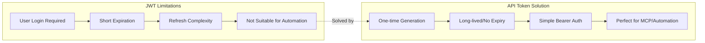
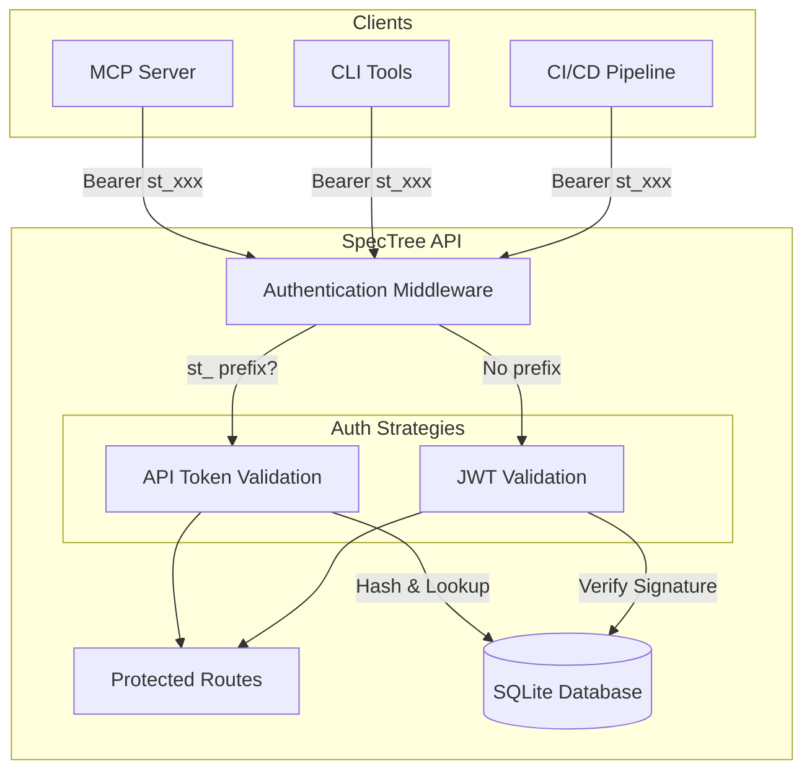
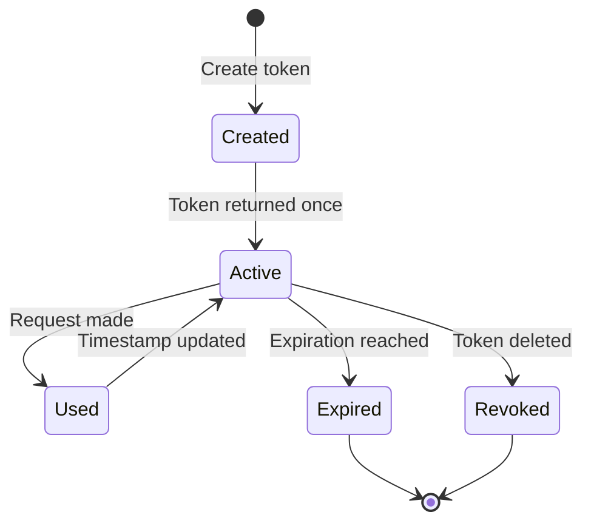
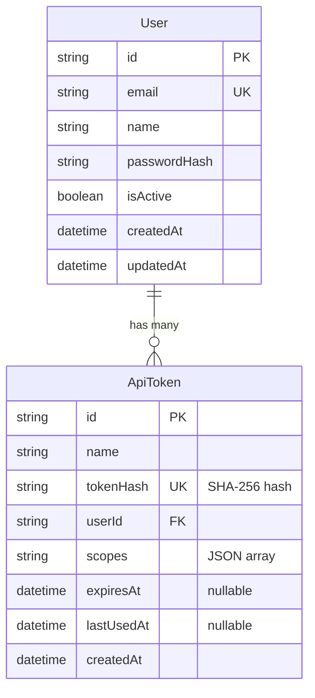
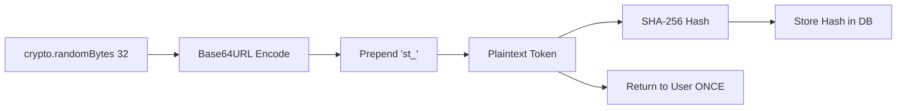
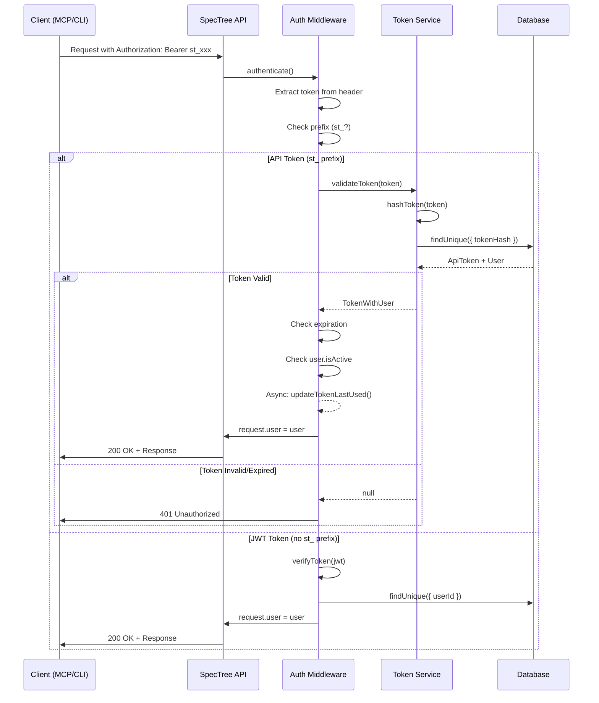
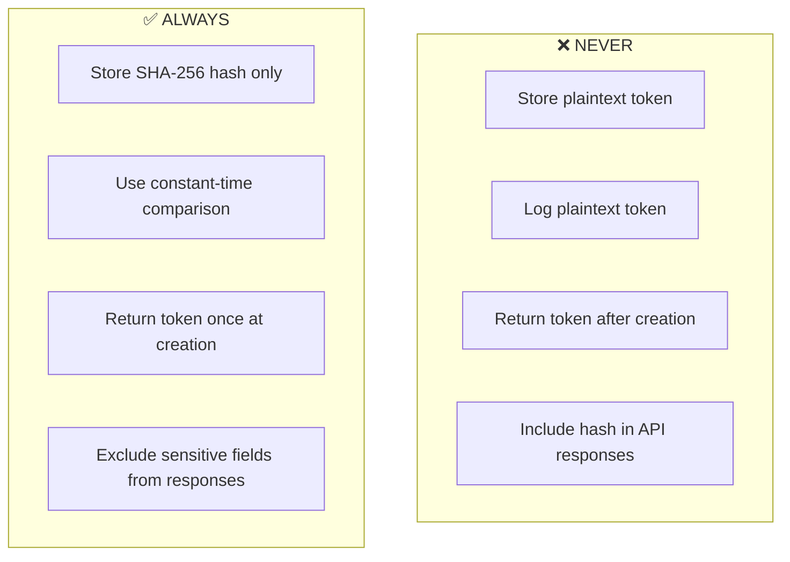
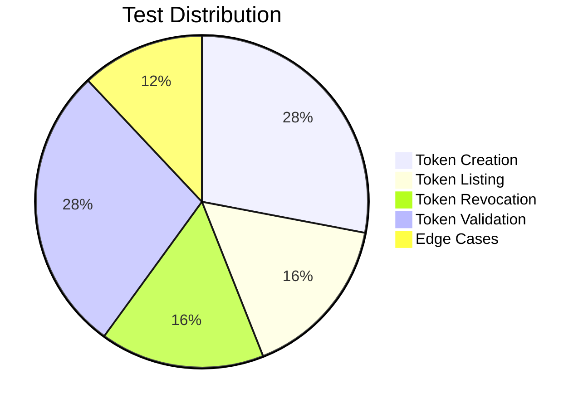

# API Token Authentication System

> **Documentation for SpecTree MCP Integration**
> 
> This document provides comprehensive documentation for the API Token Authentication System, which enables programmatic access to the SpecTree API via long-lived tokens.

---

## Table of Contents

1. [Overview](#overview)
2. [Problem Statement](#problem-statement)
3. [Architecture](#architecture)
4. [Database Schema](#database-schema)
5. [Token Format & Generation](#token-format--generation)
6. [API Endpoints](#api-endpoints)
7. [Authentication Flow](#authentication-flow)
8. [Security Considerations](#security-considerations)
9. [Implementation Files](#implementation-files)
10. [Usage Examples](#usage-examples)
11. [Test Coverage](#test-coverage)

---

## Overview

The API Token Authentication System provides long-lived, programmatic access to the SpecTree API. Unlike short-lived JWT tokens that require user login, API tokens are designed for:

- **MCP (Model Context Protocol) server integration**
- **CI/CD pipelines**
- **Automated scripts and bots**
- **Third-party integrations**

### Key Features

| Feature | Description |
|---------|-------------|
| Long-lived tokens | Optional expiration, suitable for automation |
| Secure storage | SHA-256 hashing - plaintext never stored |
| User-scoped | Each token is tied to a user account |
| Revocable | Tokens can be instantly invalidated |
| Usage tracking | `last_used_at` timestamp for security auditing |
| Scope support | Optional permission scoping (future use) |

---

## Problem Statement

The MCP server needs to authenticate with the SpecTree API without user interaction. Traditional JWT tokens have limitations for this use case:



---

## Architecture

### System Overview



### Token Lifecycle



---

## Database Schema

### `api_tokens` Table



### Prisma Schema Definition

```prisma
model ApiToken {
  id         String    @id @default(uuid())
  name       String
  tokenHash  String    @unique @map("token_hash")
  userId     String    @map("user_id")
  scopes     String?   // JSON array stored as string (SQLite)
  expiresAt  DateTime? @map("expires_at")
  lastUsedAt DateTime? @map("last_used_at")
  createdAt  DateTime  @default(now()) @map("created_at")

  user User @relation(fields: [userId], references: [id], onDelete: Cascade)

  @@index([userId])
  @@index([tokenHash])
  @@map("api_tokens")
}
```

### Field Details

| Field | Type | Constraints | Description |
|-------|------|-------------|-------------|
| `id` | UUID | Primary Key | Auto-generated unique identifier |
| `name` | String | Required, max 255 chars | Human-readable token name |
| `tokenHash` | String | Unique | SHA-256 hash of the plaintext token |
| `userId` | UUID | Foreign Key | References the owning user |
| `scopes` | String? | JSON array | Permission scopes (for future use) |
| `expiresAt` | DateTime? | Optional | Token expiration timestamp |
| `lastUsedAt` | DateTime? | Auto-updated | Last time token was used |
| `createdAt` | DateTime | Auto-set | Token creation timestamp |

### Indexes

- **`tokenHash`**: Unique index for fast token lookup during validation
- **`userId`**: Index for listing a user's tokens efficiently

### Cascade Behavior

When a user is deleted, all their API tokens are automatically deleted (`onDelete: Cascade`).

---

## Token Format & Generation

### Token Format

All SpecTree API tokens follow this format:

```
st_<base64url-encoded-random-bytes>
```

- **Prefix**: `st_` (SpecTree) for easy identification
- **Random part**: 32 cryptographically secure random bytes, base64url encoded
- **Example**: `st_K7xH2mPqR5vN8sT1wY4zA6bC9dE0fG3hI`

### Generation Algorithm



### Code Implementation

```typescript
// packages/api/src/services/tokenService.ts

import crypto from "crypto";

/**
 * Generates a cryptographically secure random token with st_ prefix.
 */
export function generateToken(): string {
  const prefix = "st_";
  const randomPart = crypto.randomBytes(32).toString("base64url");
  return `${prefix}${randomPart}`;
}

/**
 * Hashes a token using SHA-256 (one-way hash).
 */
export function hashToken(token: string): string {
  return crypto.createHash("sha256").update(token).digest("hex");
}
```

### Security Properties

| Property | Implementation |
|----------|---------------|
| Randomness | 32 bytes from `crypto.randomBytes()` (256 bits of entropy) |
| Encoding | Base64URL (URL-safe, no padding) |
| Storage | Only SHA-256 hash stored; plaintext never persisted |
| One-time display | Plaintext token returned only at creation |

---

## API Endpoints

### Endpoint Summary

| Method | Endpoint | Description | Auth Required |
|--------|----------|-------------|---------------|
| `POST` | `/api/v1/tokens` | Create a new token | JWT |
| `GET` | `/api/v1/tokens` | List user's tokens | JWT or API Token |
| `GET` | `/api/v1/tokens/:id` | Get token details | JWT or API Token |
| `DELETE` | `/api/v1/tokens/:id` | Revoke a token | JWT or API Token |

---

### POST /api/v1/tokens

Creates a new API token. **The plaintext token is only returned in this response**.

#### Request

```http
POST /api/v1/tokens
Authorization: Bearer <jwt_token>
Content-Type: application/json

{
  "name": "MCP Server Token",
  "scopes": ["read", "write"],        // optional
  "expiresAt": "2027-01-01T00:00:00Z" // optional
}
```

#### Request Body Schema

| Field | Type | Required | Description |
|-------|------|----------|-------------|
| `name` | string | Yes | Human-readable name (1-255 chars) |
| `scopes` | string[] | No | Permission scopes (default: `[]`) |
| `expiresAt` | ISO 8601 | No | Expiration date (must be future) |

#### Response (201 Created)

```json
{
  "data": {
    "id": "550e8400-e29b-41d4-a716-446655440000",
    "name": "MCP Server Token",
    "token": "st_K7xH2mPqR5vN8sT1wY4zA6bC9dE0fG3hI...",
    "scopes": ["read", "write"],
    "expiresAt": "2027-01-01T00:00:00.000Z",
    "lastUsedAt": null,
    "createdAt": "2026-01-29T16:00:00.000Z"
  },
  "message": "Token created successfully. Save this token - it will not be shown again!"
}
```

#### Error Responses

| Status | Condition |
|--------|-----------|
| 400 | Missing or empty `name` |
| 400 | `name` exceeds 255 characters |
| 400 | `expiresAt` is in the past |
| 400 | Invalid `expiresAt` format |
| 401 | Missing or invalid JWT |

---

### GET /api/v1/tokens

Lists all tokens for the authenticated user. **Token values are never returned**.

#### Request

```http
GET /api/v1/tokens
Authorization: Bearer <jwt_or_api_token>
```

#### Response (200 OK)

```json
{
  "data": [
    {
      "id": "550e8400-e29b-41d4-a716-446655440000",
      "name": "MCP Server Token",
      "scopes": ["read", "write"],
      "expiresAt": "2027-01-01T00:00:00.000Z",
      "lastUsedAt": "2026-01-29T18:30:00.000Z",
      "createdAt": "2026-01-29T16:00:00.000Z"
    },
    {
      "id": "660e8400-e29b-41d4-a716-446655440001",
      "name": "CI Pipeline Token",
      "scopes": [],
      "expiresAt": null,
      "lastUsedAt": null,
      "createdAt": "2026-01-28T10:00:00.000Z"
    }
  ]
}
```

---

### GET /api/v1/tokens/:id

Gets details for a specific token owned by the authenticated user.

#### Request

```http
GET /api/v1/tokens/550e8400-e29b-41d4-a716-446655440000
Authorization: Bearer <jwt_or_api_token>
```

#### Response (200 OK)

```json
{
  "data": {
    "id": "550e8400-e29b-41d4-a716-446655440000",
    "name": "MCP Server Token",
    "scopes": ["read", "write"],
    "expiresAt": "2027-01-01T00:00:00.000Z",
    "lastUsedAt": "2026-01-29T18:30:00.000Z",
    "createdAt": "2026-01-29T16:00:00.000Z"
  }
}
```

#### Error Responses

| Status | Condition |
|--------|-----------|
| 403 | Token belongs to another user |
| 404 | Token not found |

---

### DELETE /api/v1/tokens/:id

Revokes (permanently deletes) an API token. The token is **immediately invalidated**.

#### Request

```http
DELETE /api/v1/tokens/550e8400-e29b-41d4-a716-446655440000
Authorization: Bearer <jwt_or_api_token>
```

#### Response (204 No Content)

No body returned.

#### Error Responses

| Status | Condition |
|--------|-----------|
| 403 | Token belongs to another user |
| 404 | Token not found |

---

## Authentication Flow

### Flow Diagram



### Token Detection Logic

The middleware determines token type by prefix:

```typescript
// packages/api/src/middleware/authenticate.ts

export async function authenticate(
  request: FastifyRequest,
  _reply: FastifyReply
): Promise<void> {
  const token = extractBearerToken(request.headers.authorization);

  if (!token) {
    throw new UnauthorizedError("Missing or invalid Authorization header");
  }

  // Route based on token prefix
  if (token.startsWith("st_")) {
    await authenticateWithApiToken(request, token);
    return;
  }

  // Default to JWT
  await authenticateWithJwt(request, token);
}
```

### API Token Validation Steps

1. **Hash the incoming token** using SHA-256
2. **Lookup by hash** in `api_tokens` table
3. **Check existence** - reject if not found
4. **Check expiration** - reject if `expiresAt < now()`
5. **Check user status** - reject if `user.isActive = false`
6. **Update last_used_at** (asynchronously, non-blocking)
7. **Attach user to request** for downstream handlers

```typescript
// Simplified validation logic
async function authenticateWithApiToken(request, token) {
  const apiToken = await validateToken(token);

  if (!apiToken) {
    throw new UnauthorizedError("Invalid or expired API token");
  }

  // Async update - don't wait
  updateTokenLastUsed(apiToken.id).catch(() => {});

  // Attach user context
  request.user = {
    ...apiToken.user,
    teamId: membership?.teamId ?? null,
    role: membership?.role ?? null,
  };
  request.apiToken = apiToken;
}
```

---

## Security Considerations

### Token Storage



### Security Properties

| Concern | Mitigation |
|---------|------------|
| Token theft | Cannot reverse hash to get token |
| Database breach | Hashed tokens are useless without plaintext |
| Enumeration | 403 returned for other users' tokens (same as 404 pattern) |
| Inactive users | Tokens are checked against `user.isActive` |
| Token leakage | Token only displayed once at creation |
| Brute force | 256-bit entropy makes guessing infeasible |

### Ownership Verification

Before any token operation, ownership is verified:

```typescript
// packages/api/src/routes/tokens.ts

const token = await getTokenById(id);

if (!token) {
  throw new NotFoundError("Token not found");
}

// Critical: verify ownership before any operation
if (token.userId !== userId) {
  throw new ForbiddenError("Access denied");
}
```

### Recommendations for Clients

1. **Store tokens securely** - Use environment variables or secret managers
2. **Never commit tokens** - Add to `.gitignore` and `.env.example`
3. **Rotate periodically** - Create new tokens and revoke old ones
4. **Use scopes when available** - Limit token permissions
5. **Monitor usage** - Check `lastUsedAt` for suspicious activity

---

## Implementation Files

### File Structure

```
packages/api/
├── prisma/
│   └── schema.prisma          # ApiToken model definition
├── src/
│   ├── middleware/
│   │   └── authenticate.ts    # Dual JWT/API token auth
│   ├── routes/
│   │   └── tokens.ts          # Token CRUD endpoints
│   └── services/
│       └── tokenService.ts    # Token generation & validation
└── tests/
    └── api/
        └── tokens.test.ts     # 25 integration tests
```

### Key Components

#### `tokenService.ts`

Core token operations:

| Function | Purpose |
|----------|---------|
| `generateToken()` | Creates cryptographically secure token |
| `hashToken()` | SHA-256 hashes a token |
| `createToken()` | Creates token record in DB |
| `validateToken()` | Validates token and returns user |
| `updateTokenLastUsed()` | Updates usage timestamp |
| `listTokens()` | Lists user's tokens (metadata only) |
| `getTokenById()` | Gets single token metadata |
| `revokeToken()` | Deletes token from DB |

#### `authenticate.ts`

Middleware handling:

| Function | Purpose |
|----------|---------|
| `authenticate()` | Main preHandler hook |
| `extractBearerToken()` | Parses Authorization header |
| `authenticateWithApiToken()` | Handles `st_` tokens |
| `authenticateWithJwt()` | Handles JWT tokens |

#### `tokens.ts`

REST endpoints:

| Route | Handler |
|-------|---------|
| `POST /` | Create token |
| `GET /` | List tokens |
| `GET /:id` | Get single token |
| `DELETE /:id` | Revoke token |

---

## Usage Examples

### Creating a Token (via JWT)

```bash
# First, authenticate and get a JWT
JWT=$(curl -s -X POST http://localhost:3000/api/v1/auth/login \
  -H "Content-Type: application/json" \
  -d '{"email":"user@example.com","password":"password"}' \
  | jq -r '.data.accessToken')

# Create an API token
curl -X POST http://localhost:3000/api/v1/tokens \
  -H "Authorization: Bearer $JWT" \
  -H "Content-Type: application/json" \
  -d '{
    "name": "MCP Server Token",
    "scopes": ["read", "write"]
  }'

# Response:
# {
#   "data": {
#     "id": "...",
#     "token": "st_K7xH2mPq...",  <-- SAVE THIS!
#     ...
#   }
# }
```

### Using an API Token

```bash
# Use the API token for subsequent requests
API_TOKEN="st_K7xH2mPqR5vN8sT1..."

# Access any protected endpoint
curl http://localhost:3000/api/v1/users/me \
  -H "Authorization: Bearer $API_TOKEN"

# List projects
curl http://localhost:3000/api/v1/projects \
  -H "Authorization: Bearer $API_TOKEN"

# Create a feature
curl -X POST http://localhost:3000/api/v1/features \
  -H "Authorization: Bearer $API_TOKEN" \
  -H "Content-Type: application/json" \
  -d '{"title": "New Feature", "projectId": "..."}'
```

### MCP Server Configuration

```json
// Example MCP server configuration
{
  "spectree": {
    "apiUrl": "http://localhost:3000/api/v1",
    "apiToken": "st_K7xH2mPqR5vN8sT1..."
  }
}
```

### Revoking a Token

```bash
# List tokens to find the ID
curl http://localhost:3000/api/v1/tokens \
  -H "Authorization: Bearer $JWT"

# Revoke a specific token
curl -X DELETE http://localhost:3000/api/v1/tokens/550e8400-... \
  -H "Authorization: Bearer $JWT"
```

---

## Test Coverage

The API Token system includes **25 comprehensive integration tests** covering all scenarios.

### Test Categories



### Test Summary

#### Token Creation (7 tests)

| Test | Validates |
|------|-----------|
| Create with valid name | Basic creation flow |
| Create with scopes and expiration | Optional fields |
| Store only hash in DB | Security: no plaintext storage |
| Reject missing name | Validation |
| Reject empty name | Validation |
| Reject past expiration | Validation |
| Require authentication | Security |

#### Token Listing (4 tests)

| Test | Validates |
|------|-----------|
| List user tokens | Basic listing |
| Empty array when no tokens | Edge case |
| Isolation between users | Security: no cross-user access |
| Require authentication | Security |

#### Token Revocation (4 tests)

| Test | Validates |
|------|-----------|
| Revoke own token | Basic revocation |
| 404 for non-existent token | Error handling |
| 403 for other user's token | Security: ownership check |
| Require authentication | Security |

#### Token Validation (7 tests)

| Test | Validates |
|------|-----------|
| Authenticate with valid token | Happy path |
| Reject invalid token | Security |
| Reject expired token | Expiration handling |
| Update last_used_at | Usage tracking |
| Reject inactive user's token | Security |
| Immediate invalidation on revoke | Security |
| JWT passthrough | Backward compatibility |

#### Edge Cases (3 tests)

| Test | Validates |
|------|-----------|
| Max length name (255 chars) | Boundary |
| Reject over-length name | Validation |
| Generate unique tokens | Randomness |

### Running Tests

```bash
cd packages/api
npm run test -- tests/api/tokens.test.ts
```

---

## Related Documentation

- [Linear Issue COM-234](https://linear.app/apps316/issue/COM-234) - Parent feature issue
- [COM-235](https://linear.app/apps316/issue/COM-235) - Database schema
- [COM-236](https://linear.app/apps316/issue/COM-236) - Token generation endpoint
- [COM-237](https://linear.app/apps316/issue/COM-237) - Token validation middleware
- [COM-238](https://linear.app/apps316/issue/COM-238) - Token management endpoints
- [COM-239](https://linear.app/apps316/issue/COM-239) - Unit tests

---

## Changelog

| Date | Change |
|------|--------|
| 2026-01-29 | Initial implementation complete (25/25 tests passing) |
